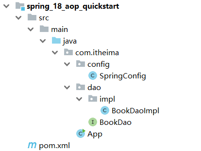
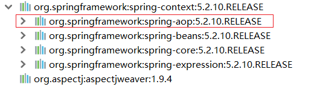
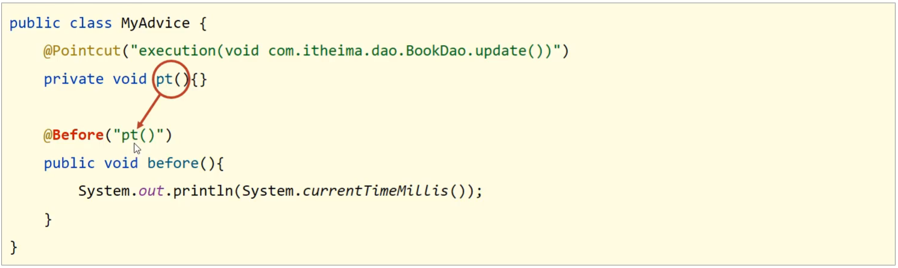
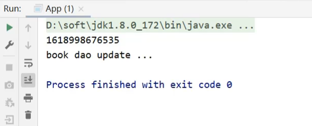

在这里,继续了解一下AOP的概念


(1)Spring的AOP是对一个类的方法,在不进行任何修改的前提下实现增强。对于上述案例中BookServiceImpl中有`save`,`update`,`delete`和`select`方法,这些方法我们给起了一个名字叫==连接点==

(2)在BookServiceImpl的四个方法中，`update`和`delete`只有打印没有计算万次执行消耗时间，但是在运行的时候已经有该功能，那也就是说`update`和`delete`方法都已经被增强，所以对于需要增强的方法我们给起了一个名字叫==切入点==

(3)存放共性概念的方法,起了个名字叫==通知==

(4)通知是要增强的内容，会有多个，切入点是需要被增强的方法，那哪个切入点需要添加哪个通知，就需要提前将它们之间的关系描述清楚，那么对于通知和切入点之间的关系描述，我们给起了个名字叫==切面==

(5)通知是一个方法，方法不能独立存在需要被写在一个类中，这个类我们也给起了个名字叫==通知类==

至此AOP中的核心概念就已经介绍完了，总结下:

- 连接点(JoinPoint)：程序执行过程中的任意位置，粒度为执行方法、抛出异常、设置变量等
  - 在SpringAOP中，理解为方法的执行
- 切入点(Pointcut):匹配连接点的式子
  - 在SpringAOP中，一个切入点可以描述一个具体方法，也可也匹配多个方法
    - 一个具体的方法:如com.itheima.dao包下的BookDao接口中的无形参无返回值的save方法
    - 匹配多个方法:所有的save方法，所有的get开头的方法，所有以Dao结尾的接口中的任意方法，所有带有一个参数的方法
    - 连接点范围要比切入点范围大，是切入点的方法也一定是连接点，但是是连接点的方法就不一定要被增强，所以可能不是切入点。
- 通知(Advice):在切入点处执行的操作，也就是共性功能
  - 在SpringAOP中，功能最终以方法的形式呈现
- 通知类：定义通知的类
- 切面(Aspect):描述通知与切入点的对应关系。

**小结**

- AOP的核心概念
  - 连接点
  - 切入点
  - 通知
  - 通知类

## 2，AOP入门案例

#### 2.1 需求分析

案例设定：测算接口执行效率，但是这个案例稍微复杂了点，我们对其进行简化。

简化设定：在方法执行前输出当前系统时间。

在这里,通过SpringAOP注解方法完成在方法执行的前打印出当前系统时间

#### 2.2思路分析

在这里分析一下,通过注解开发AOP,分为几个步骤

> 1 导入坐标(pom.xml)
>
> 2 制作连接点(原始操作，Dao接口与实现类))
>
> 3 制作共性概念(通知类与通知)
>
> 4 定义切入点
>
> 5 绑定切入点与通知关系(切面)

1. 添加pom.xml

```java
<dependencies>
    <dependency>
        <groupId>org.springframework</groupId>
        <artifactId>spring-context</artifactId>
        <version>5.2.10.RELEASE</version>
    </dependency>
</dependencies>
```

2. 添加BookDao和BookDao类

```java
public interface BookDao {
    public void save();
    public void update();
}

@Repository
public class BookDaoImpl implements BookDao {

    public void save() {
        System.out.println(System.currentTimeMillis());
        System.out.println("book dao save ...");
    }

    public void update(){
        System.out.println("book dao update ...");
    }
}
```

3. 创建Spring的配置类

```java
@Configuration
@ComponentScan("com.itheima")
public class SpringConfig {
}
```

4. 编写App运行类

```java
public class App {
    public static void main(String[] args) {
        ApplicationContext ctx = new AnnotationConfigApplicationContext(SpringConfig.class);
        BookDao bookDao = ctx.getBean(BookDao.class);
        bookDao.save();
    }
}
```

最终创建好的项目结构如下:



**说明:**

- 目前打印save方法的时候，因为方法中有打印系统时间，所以运行的时候是可以看到系统时间
- 对于update方法来说，就没有该功能
- 在这里使用SpringAOP的方法在不改变update方法的前提下，让其拥有打印系统时间的功能。

#### 2.3 AOP的实现步骤

##### 步骤1:添加依赖

pom.xml

```java
<dependency>
    <groupId>org.aspectj</groupId>
    <artifactId>aspectjweaver</artifactId>
    <version>1.9.4</version>
</dependency>
```



- 因为`spring-context`中已经导入了`spring-aop`,所以不需要再单独导入`spring-aop`
- 导入AspectJ的jar包,AspectJ是AOP思想的一个具体实现，Spring有自己的AOP实现，但是相比于AspectJ来说比较麻烦，所以我们直接采用Spring整合ApsectJ的方式进行AOP开发。

##### 步骤2:定义接口与实现类

```java
环境准备的时候，BookDaoImpl已经准备好，不需要做任何修改
```

##### 步骤3:定义通知类和通知

通知就是将共性功能抽取出来后形成的方法，共性功能指的就是当前系统时间的打印。

```java
public class MyAdvice {
    public void method(){
        System.out.println(System.currentTimeMillis());
    }
}
```

##### 步骤4:定义切入点

BookDaoImpl中有两个方法，分别是save和update,要增强的是update方法,该如何定义

```java
public class MyAdvice {
    @Pointcut("execution(void com.itheima.dao.BookDao.update())")
    private void pt(){}
    public void method(){
        System.out.println(System.currentTimeMillis());
    }
}
```

**说明:**

- 切入点定义依托一个不具有实际意义的方法进行，即无参数、无返回值、方法体无实际逻辑
- execution及后面编写的内容，后面会有章节专门去学习。

在这里,有一个注释@Pointcut,**作用是设置切入的方法,也就是设置切入点**,

##### 步骤5:制作切面

切面用来描述通知和切入点之间的关系,通过@Before等来进行绑定

```java
public class MyAdvice {
    @Pointcut("execution(void com.itheima.dao.BookDao.update())")
    private void pt(){}
    
    @Before("pt()")
    public void method(){
        System.out.println(System.currentTimeMillis());
    }
}
```

绑定切入点与通知关系，并指定通知添加到原始连接点的具体执行==位置==



**说明:**@Before翻译过来是之前，也就是说,通知会在切入点方法之前执行,除此自外,还有四周其他类型

##### 步骤6:将通知类配给容器并标识其为切面类

```java
@Component
@Aspect
public class MyAdvice {
    @Pointcut("execution(void com.itheima.dao.BookDao.update())")
    private void pt(){}
    
    @Before("pt()")
    public void method(){
        System.out.println(System.currentTimeMillis());
    }
}
```

多了两个注释,一个@Component,一个是	@Aspect,标记这个面为切面

##### 步骤7:开启注解格式AOP功能

```java
@Configuration
@ComponentScan("com.itheima")
@EnableAspectJAutoProxy
public class SpringConfig {
}
```

看到在执行update方法之前打印了系统时间戳，说明对原始方法进行了增强，AOP编程成功。



在这里有几个注释需要注意一下

@EnableAspectJAutoProxy ,这个注释的作用是开启注解格式AOP功能
