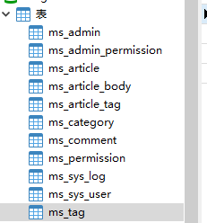

在这里,记录自己创建博客当中遇到的问题，以及实现等。

在这里,对表的结构进行,分析一个


首先是管理员表

管理员拥有 用户名,密码是否可见?(一般不可见,通过JWT加密),除此之外还有创建时间和最后的登录时间(用于记录管理的最后登录时间)

目录结构表,创建的时候,基于生成问题,目录都是动态生成的因此需要一张

文章表,通过什么形式存储在文章表当中


在这里列出所有拥有的表(以后可能会增加)

1. 管理员表**ms_admin**(用户的用户名以及密码,用于设计等)

2. 管理员权限表**ms_admin_permission**(在这里管理用户的权限)

3. 文章表**ms_article**(在这里有每一篇文章的id,日期,标题等,以及评论总数)
4. 文章内容表,**ms_article_body**这里是文章的内容表
5. 文章标签表**ms_article_tag**(在这里管理文章的标签)
6. 文章目录表**ms_category**(这里的static代表文章结构,后续会改)
7. 评论表 **ms_comment**(评论,包含了相关的uuid)
8. 用户权限表**ms_permission**（这里定义了权限功能)
9. 系统log表**ms_sys_log**(这里是系统的log)
10. 用户表**ms_sys_user**这里是用户的
11. 文章目录**ms_tag**这里是文章目录




一些注意点

```
dependencyManagement
```

这个博客是一个**单体项目**,但是如果说拥有很多个项目,每个都需要指定版本号


回忆某个注释的作用

**@Configuration**,

Configuration配置注释,一般用来在里面初始化一些配置类

**configuration**和**component**的区别在于,configuration只能生成一个对象,component则有多个对象


**@SpringBootApplication**这个注解,用于标记这是一个主程序,是一个springboot应用


在Pojo中的常用注释

```java
常用的几个注解：
@Data ： 注在类上，提供类的get、set、equals、hashCode、canEqual、toString方法
@AllArgsConstructor ： 注在类上，提供类的全参构造
@NoArgsConstructor ： 注在类上，提供类的无参构造
@Setter ： 注在属性上，提供 set 方法
@Getter ： 注在属性上，提供 get 方法
@EqualsAndHashCode ： 注在类上，提供对应的 equals 和 hashCode 方法
@Log4j/@Slf4j ： 注在类上，提供对应的 Logger 对象，变量名为 log
```

在这里通过注入一个**@Data**注释提供了,get、set、equals、hasCode、canEqual、toString等方法


springboot中的层次划分


Entity(pojo):实体层,**数据库中的类**

entity层是实体层,也就是所谓的modal层,也称为pojo层,是数据库在项目中的类,该文件包含实体类的属性和对应属性的set、get方法

DAO(mapper),持久层,主要与数据库进行交互

DAO层=mapper层，现在用Mybatis逆向工程生成的mapper层,其实就是dao层。DAO层会调用entity层，DAO中会定义实际使用到的方法,比如增删改查。DAO 层的数据源和数据库连接的参数都是在配置文件中进行配置的,配置文件一般在同层的XML文件夹中。数据持久化操作就是指，把数据放到持久化的介质中，同时提供增删改查操作。

**Service**层:业务层 控制业务

Service层主要负责业务模块的逻辑应用设计。先设计放接口的类，再创建实现的类，然后在配置文件中进行配置其实现的关联。service层调用dao层接口，接收dao层返回的数据，完成项目的基本功能设计。

pojo->mapper-service

Controller层:控制层,**控制业务逻辑**

Controller层负责具体的业务模块流程的控制

controller层负责前后端交互，接受前端请求，调用service层，接收service层返回的数据，最后返回具体的页面和数据到客户端。

Controller层像是一个服务员，他把客人（前端）点的菜（数据、请求的类型等）进行汇总什么口味、咸淡、量的多少，交给厨师长（Service层）

厨师长则告诉沾板厨师（Dao 1）、汤料房（Dao 2）、配菜厨师（Dao 3）等（统称Dao层）我需要什么样的半成品，副厨们（Dao层）就负责完成厨师长（Service）交代的任务。

具体的流程为

```java
controller--->service接口-->serviceImpl->dao接口--->daoImll--》mapper-->db
```

Controller层调用Service层的方法，Service层调用Dao层中的方法，其中调用的参数是使用Entity层进行传递的。
