在这里整理一下需要记录的东西。

## 1. 项目结构

--------------------------config--此目录负责项目的相关配置,例如规定哪里是 **mapper**

--------------------------dao--此层负责对整个数据库进行操作,dao层的意思是持久层,在这里其实应该的web层

---------------Contorller--请求的最后一层,控制业务逻辑负责前后端交互,之后是Service层

---------------Service层--控制业务,在这里对请求到mapper的数据进行修改

-----impl -- 这里是Service的实现类,考虑到可能有多数据库

---------------pojo层--存放实体类,之一层有时候也叫做entity

---------------vo层,被称为视图层,当遇到entity不需要的元素,就通过vo去除。

## 2. 执行顺序


> Controller-->service接口-->serviceImpl-->dao接口-->daoImpl-->mapper-->db

这是当前端请求的时候,代码的执行顺序


## 3.分析表的数据结构

在这里列出所有拥有的表(以后可能会增加)

1. 管理员表**ms_admin**(用户的用户名以及密码,用于设计等)

2. 管理员权限表**ms_admin_permission**(在这里管理用户的权限)

3. 文章表**ms_article**(在这里有每一篇文章的id,日期,标题等,以及评论总数)
4. 文章内容表,**ms_article_body**这里是文章的内容表
5. 文章标签表**ms_article_tag**(在这里管理文章的标签)
6. 文章目录表**ms_category**(这里的static代表文章结构,后续会改)
7. 评论表 **ms_comment**(评论,包含了相关的uuid)
8. 用户权限表**ms_permission**（这里定义了权限功能)
9. 系统log表**ms_sys_log**(这里是系统的log)
10. 用户表**ms_sys_user**这里是用户的
11. 文章目录**ms_tag**这里是文章目录

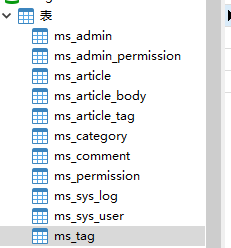

先分析文章表的字段

#### 需要的字段

```java
一篇文章需要id,因此返回id
文章里面有标题因此,返回title
 除此之外还有总结 summary字段 评论总数conmmentCounts 观看次数viewCounts,权重weight,创建时间 createDate,作者author,文章体:body 以及标签tags 和分类列表catergorys
```

不需要的字段

```java
下面是没用返回的 author_id body_id categoryid
```

#### 数据库什么时候使用什么字段的问题

#### bigint和int的区别

如果需要的范围比int大就用bigint

#### vachar格式

varchar用于存储字符串格式,例如存储某一篇文章

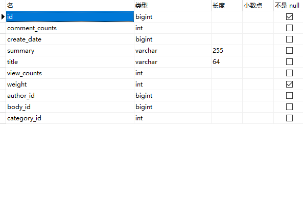

#### Bit的用法

如果存储的范围比较小,就用bit,bit的存储范围是:[1,64]默认是1,在java中则用`Integer`

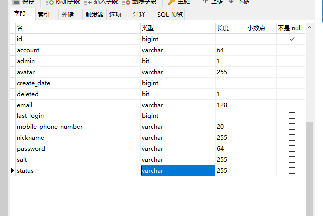


## 4.所用到注解的作用

#### 4.1@dependencyManagement

这个博客是一个**单体项目**,但是如果说拥有很多个项目,每个都需要指定版本号,通过@dependencyManagement,某些子项目可以不用指定版本号,**对版本号进行统一管理**

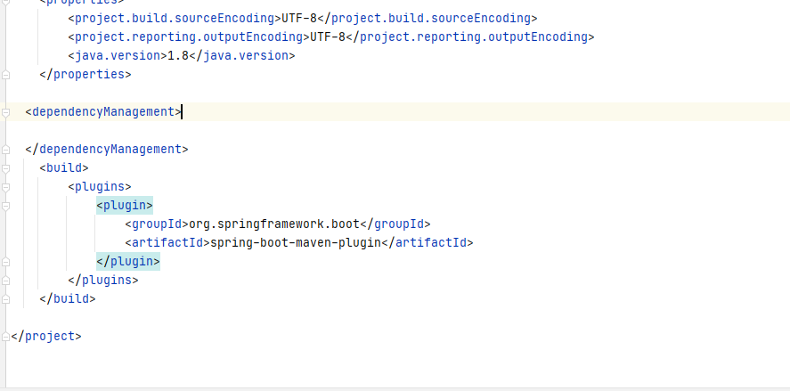

#### 4.2**@Configuration**,

Configuration配置注释,一般用来在里面初始化一些配置类

**configuration**和**component**的区别在于,configuration只能生成一个对象,component则有多个对象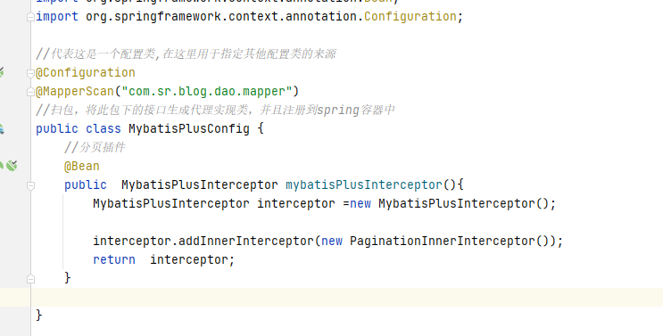

**@SpringBootApplication**这个注解,用于标记这是一个主程序,是一个springboot应用

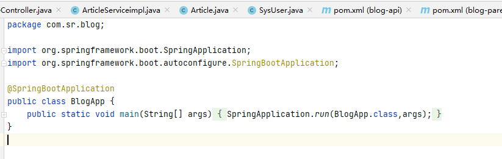

#### 4.3在Pojo中的常用注释

```java
常用的几个注解：
@Data ： 注在类上，提供类的get、set、equals、hashCode、canEqual、toString方法
@AllArgsConstructor ： 注在类上，提供类的全参构造
@NoArgsConstructor ： 注在类上，提供类的无参构造
@Setter ： 注在属性上，提供 set 方法
@Getter ： 注在属性上，提供 get 方法
@EqualsAndHashCode ： 注在类上，提供对应的 equals 和 hashCode 方法
@Log4j/@Slf4j ： 注在类上，提供对应的 Logger 对象，变量名为 log
```

在这里通过注入一个**@Data**注释提供了,get、set、equals、hasCode、canEqual、toString等方法

#### 4.4浅谈@RequestMapping @ResponseBody 和 @RequestBody 注解的用法与区别

##### 4.4.1.@RequestMapping

国际惯例先介绍什么是@RequestMapping，@RequestMapping 是一个用来处理请求地址映射的注解，可用于类或方法上。**用于类上，表示类中的所有响应请求的方法都是以该地址作为父路径**；**用于方法上，表示在类的父路径下追加方法上注解中的地址将会访问到该方法**，**此处需注意@RequestMapping用在类上可以没用，但是用在方法上必须有**。

**例如：**

```java
@Controller
//设置想要跳转的父路径
@RequestMapping(value = "/Controllers")
public class StatisticUserCtrl {
    //如需注入，则写入需要注入的类
    //@Autowired
 
            // 设置方法下的子路经
            @RequestMapping(value = "/method")
            public String helloworld() {
 
                return "helloWorld";
 
            }
}
```

**总的@RequestMapping来说,就是写请求路径,和前端对应,是请求的接口路径**

##### 4.4.2 @ResponseBody

@Responsebody 注解表示该方法的返回的结果直接写入 HTTP 响应正文（ResponseBody）中，一般在异步获取数据时使用，通常是在使用 @RequestMapping 后，返回值通常解析为跳转路径，加上 @Responsebody 后返回结果不会被解析为跳转路径，而是直接写入HTTP 响应正文中。

**使用时机：**
返回的数据不是html标签的页面，**而是其他某种格式的数据时（如json、xml等）使用；**

也就是说,通常在需要返回的是json时,使用ResponseBody

异步获取 json 数据，加上 @Responsebody 注解后，就会直接返回 json 数据。

**例如：**

```typescript
@RequestMapping(value = "user/login")
@ResponseBody
// 将ajax（datas）发出的请求写入 User 对象中,返回json对象响应回去
public User login(User user) {   
    User user = new User();
    user .setUserid(1);
    user .setUsername("MrF");
    user .setStatus("1");
    return user ;
}
```

##### 4.4.3 @RequestBody

@RequestBody 注解则是将 HTTP 请求正文插入方法中，使用适合的 HttpMessageConverter 将请求体写入某个对象。

**作用：**

> （1) 该注解用于读取Request请求的body部分数据，使用系统默认配置的HttpMessageConverter进行解析，然后把相应的数据绑定到要返回的对象上
>
> (2) 再把HttpMessageConverter返回的对象数据绑定到 controller中方法的参数上。

**使用时机：**

A) GET、POST方式提时， 根据request header Content-Type的值来判断:

> application/x-www-form-urlencoded， 可选（即非必须，因为这种情况的数据@RequestParam, @ModelAttribute也可以处理，当然@RequestBody也能处理）；
>
> multipart/form-data, 不能处理（即使用@RequestBody不能处理这种格式的数据）；
> 其他格式， 必须（其他格式包括application/json, application/xml等。这些格式的数据，必须使用@RequestBody来处理）；

**例如：**

```less
@RequestMapping(value = "user/login")
@ResponseBody
// 将ajax（datas）发出的请求写入 User 对象中
public User login(@RequestBody User user) {   
// 这样就不会再被解析为跳转路径，而是直接将user对象写入 HTTP 响应正文中
    return user;    
}
```

B) PUT方式提交时， 根据request header Content-Type的值来判断:

> application/x-www-form-urlencoded， 必须；multipart/form-data, 不能处理；其他格式， 必须；

说明：request的body部分的数据编码格式由header部分的Content-Type指定；

#### 4.4.4@requestBody与responseBoy的区别

##### 一、@RequestBody

@RequestBody的作用是将前端传来的json格式的数据转为自己定义好的javabean对象

如图以微信小程序为例，前端向后端传入如下json格式的数据


需要注意的是传入数据的属性名称要和后端javabean中定义的一致


发送请求后可以看到在控制台中我们通过javabean对象的get方法打印出了前端传来的值，说明json数据已经成功的被转换为了javabean对象，将对应的属性进行了赋值


**注：@RequestBody要写在方法的参数前，不能写在方法名上方**


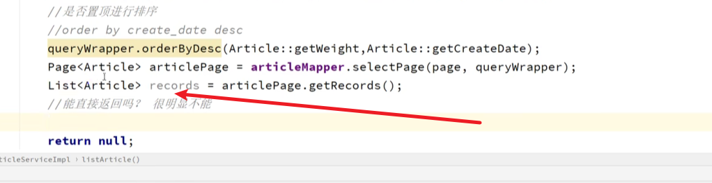

##### 二、 @ResponseBody

@ResponseBody的作用是将后端以return返回的javabean类型数据转为json类型数据。在此就不做具体的事例演示

**注：@ResponseBody要写在方法名上**


也就是说,**ResponseBody**就是将传过来的json转换为需要的javaBean,而 **RequestBody**就是将需要的数据为Json再传过去。


## 5.业务逻辑

在这里,分析一下整个项目的业务逻辑.包括项目是在哪里启动的,

### 5.1 启动

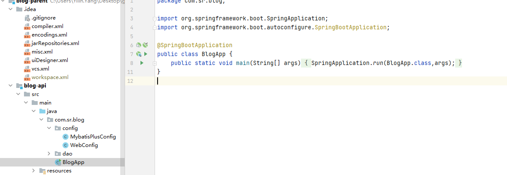

这里是入口类,通过 **@SpringBootApplication**来部署启动类


### 5.2 配置

Mybatispulus的配置,这下面是Mapper的映射

@Configuration标明这是一个配置

@MapperScan标明Mapper在哪里

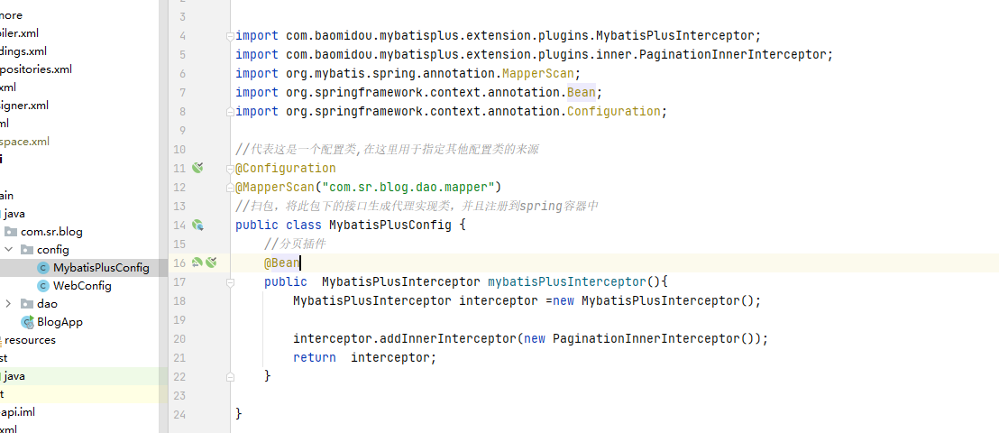

这里则是配置了跨域

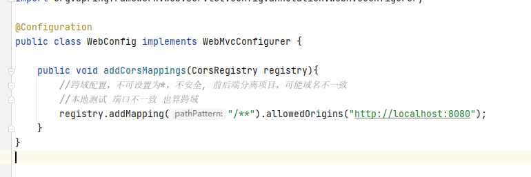


### 5.3 查询文章功能

前端需要文章的 id,title等数据,返回这些数据来构成文章的内容。

#### 5.3.1登录的状态

在这里通过SysUser来存储登录的用户,除此之外,还需要文章Article,以及Tag三张表

Article

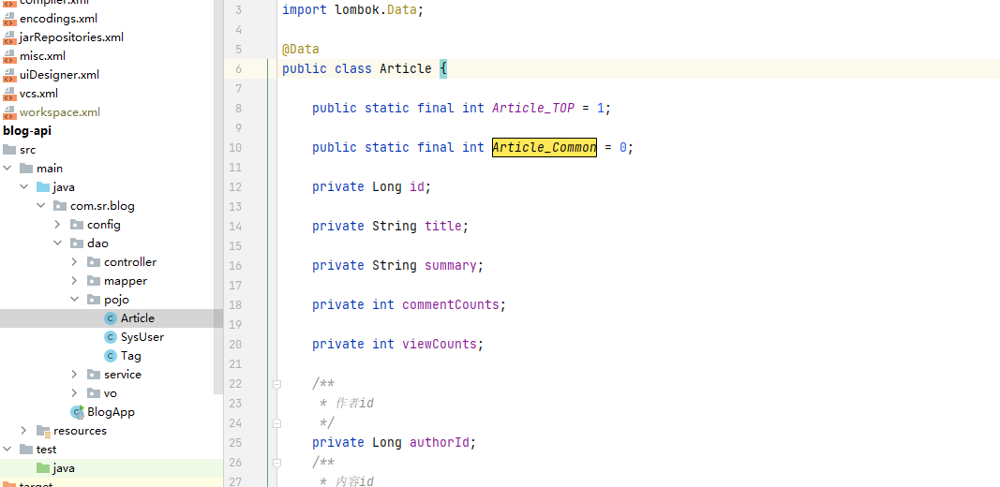

SysUser

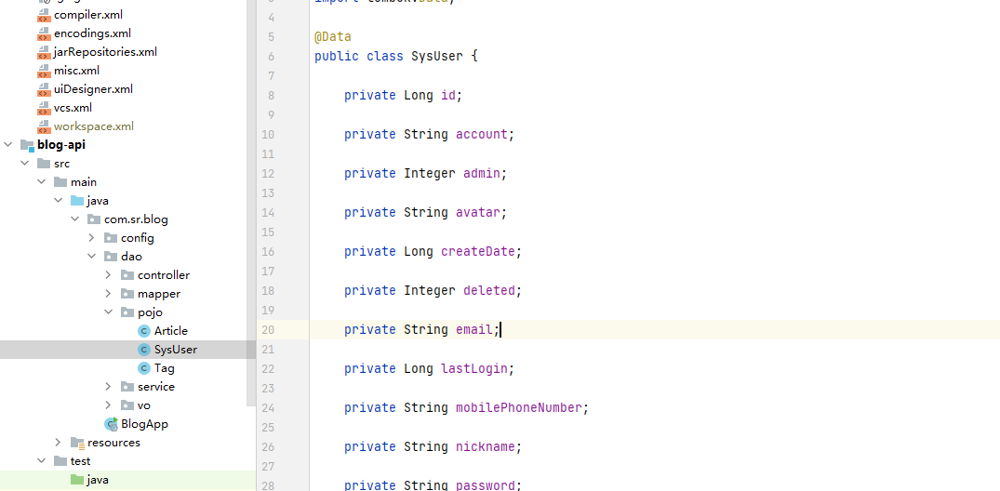

Tag

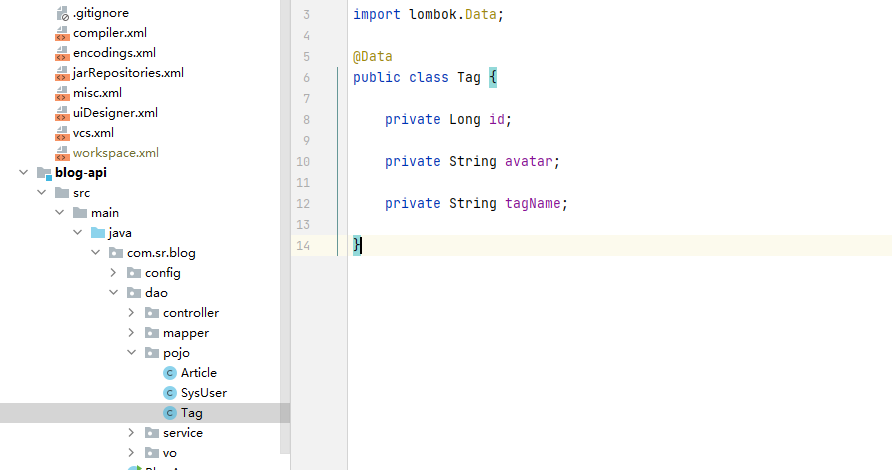
