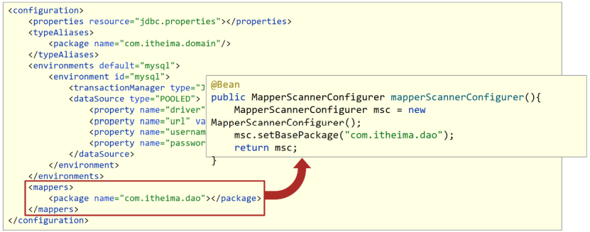

首先复习一下,SpringMVC架构

## 1 MVC模式

MVC 是一种分层开发的模式，其中：

* M：Model，业务模型，处理业务

* V：View，视图，界面展示

* C：Controller，控制器，处理请求，调用模型和视图


控制器（serlvlet）用来接收浏览器发送过来的请求，控制器调用模型（JavaBean）来获取数据，比如从数据库查询数据；控制器获取到数据后再交由视图（JSP）进行数据展示。

**MVC 好处：**

* 职责单一，互不影响。每个角色做它自己的事，各司其职。

* 有利于分工协作。

* 有利于组件重用


### 1.2.  MVC 和 三层架构

通过 MVC 和 三层架构 的学习，有些人肯定混淆了。那他们有什么区别和联系？


如上图上半部分是 MVC 模式，上图下半部分是三层架构。 `MVC 模式` 中的 C（控制器）和 V（视图）就是 `三层架构` 中的表现层，而 `MVC 模式` 中的 M（模型）就是 `三层架构` 中的 业务逻辑层 和 数据访问层。

可以将 `MVC 模式` 理解成是一个大的概念，而 `三层架构` 是对 `MVC 模式` 实现架构的思想。 那么我们以后按照要求将不同层的代码写在不同的包下，每一层里功能职责做到单一，将来如果将表现层的技术换掉，而业务逻辑层和数据访问层的代码不需要发生变化。


在这里项目结构,如下


原始的Web层,是通过new出一个对象,然后调用对象身上的方法,


存在一些问题,例如图上,此时的 BrandService还没有解耦,如果这时候,我们需要修改实现类,就必须更改这里的掉Web层里面的内容。

##### 缺点

**耦合度太高**了,此时如果我想改变一处,另一处也必须要改变,**不利已解耦**。


如上图,第一个,在数据层的实现当中,可能有会引用第一个实现,因此不能直接修改,必须再有一个新的实现,但是这个新的实现,就必须改变业务层的代码,因此耦合度太高

在这里引入IOC/DI以及AOP的概念,通过IOC/DI以及AOP对整个容器进行控制。


### 1.3 IOC/DI以及AOP

不自己去new,而是通过外部生成自己需要的bean,这就是所谓**IOC反转控制**,存放相关对象的容器,就被称为**IOC容器**

### 


生成之后,还不能运行,因为service运行依赖于dao对象,ioc中虽然有service和dao对象,**但是service和dao对象没有关系** 需要dao对象交给service,一九二四说要绑定


总结一下,关于IOC的核心观念

在这里,主要学习了两个概念,一个是IOC(反转控制),一个是Dl(依赖注入)

IOC被称为==控制反转==,由==外部==提供对象,此过程中对象创建控制权由程序转移到外部,被称为控制反转


在这里**通过di整合了两个的关系**,所以就叫**依赖注入**

在容器中建立bean与bean之间的依赖关系的整个过程,称为依赖注入

- 业务层要用数据层的类对象,以前是自己`new`的
- 现在不new了,靠`外部[也就是指的ioc容器]`来给注入,
- 这种思想也就是依赖注入

(2) IOC容器中那些bean之间要建立依赖注入

根据具体的需求，如业务层依赖数据层 service就要和dao建立依赖关系。

一切的目标就是充分解耦

- IOC容器管理bean(IOC)
- 在IOC容器将有依赖关系的bean进行关系绑定(DI)
- 使用对象时,不仅可以直接从IOC容器中获取,并且获取到的bean已经绑定了所有的依赖关系。

#### 1.3.1 核心容器总结(现在比较少使用)

这里总结一下当使用propetipes和xml时配置bean的问题

##### 1.3.1.1 容器相关

- BeanFactory是IoC容器的顶层接口，初始化BeanFactory对象时，加载的bean延迟加载 
- ApplicationContext接口是Spring容器的核心接口，初始化时bean立即加载 
- ApplicationContext接口提供基础的bean操作相关方法，通过其他接口扩展其功能 
- ApplicationContext接口常用初始化类 
  - ClassPathXmlApplicationContext(常用) 
  - FileSystemXmlApplicationContext

##### 1.3.1.2 bean相关


其实整个配置中最常用的就两个属性id和class。

把scope、init-method、destroy-method框起来的原因是，后面注解在讲解的时候还会用到， 所以大家对这三个属性关注下。

##### 1.3.1.3 依赖注入相关


### 1.4IOC/DI注解开发

IOC/Di还可以基于通过注解开发,进一步简化代码


#### 1.4.1注解开发定义bean

第一步删除原先的xml配置

```java
1 <bean id="bookDao" class="com.itheima.dao.impl.BookDaoImpl"/>
```

第二步,在Dao(Mapper)上添加注解

```java
@Component("bookDao")
public class BookDaoImpl implements BookDao {
public void save() {
System.out.println("book dao save ..." );
}
}
```

**注意:@Component注解不可以添加在接口上，因为接口是无法创建对象的。**

XML与注解配置的对应关系:


第三步,在xml文件当中配置,进行包扫描

```java
<?xml version="1.0" encoding="UTF-8"?>
<beans xmlns="http://www.springframework.org/schema/beans"
xmlns:xsi="http://www.w3.org/2001/XMLSchema-instance"
xsi:schemaLocation="
http://www.springframework.org/schema/beans
http://www.springframework.org/schema/beans/spring-beans.xsd">
<context:component-scan base-package="com.itheima"/>
</beans>
```

说明:

component-scan

- component:组件,Spring将管理的bean视作自己的一个组件
- scan:扫描

base-package指定Spring框架扫描的包路径，它会扫描指定包及其子包中的所有类上的注解。

- 包路径越多[如:com.itheima.dao.impl]，扫描的范围越小速度越快
- 包路径越少[如:com.itheima],扫描的范围越大速度越慢
- 一般扫描到项目的组织名称即Maven的groupId下[如:com.itheima]即可。

步骤4：运行程序


步骤5:Service上添加注解

在BookServiceImpl类上也添加@Component交给Spring框架管理

```java
@Component
public class BookServiceImpl implements BookService {
private BookDao bookDao;
public void setBookDao(BookDao bookDao) {
this.bookDao = bookDao;
}
public void save() {
System.out.println("book service save ...");
bookDao.save();
}
}
```

总的来说注意一个知识点

@component等注释

@component/@contoroller/@service/@repository,来设置该类未spring管理的bean,不用再另外配置bean

#### 1.4.2纯注解开发

在之前已经通过删去bean的方法了,在这里,可以通过配置SpringConfig的方法来实现配置

1. 配置一个`SrpingConfig`

```java
public class SpringConfig {
}
```

2. 在这之上加一个@Configuration,标志他是配置类

在配置类上添加@Configuration注解，将其标识为一个配置类,替换applicationContext.xml

```java
@Configuration
public class SpringConfig {
}
```

步骤3:用注解替换包扫描配置

在配置类上添加包扫描注解@ComponentScan替换

```java
@Configuration
@ComponentScan("com.itheima")
public class SpringConfig {
}
```

步骤4:创建运行类并执行

创建一个新的运行类AppForAnnotation

```java
public class AppForAnnotation {
public static void main(String[] args) {
ApplicationContext ctx = new
AnnotationConfigApplicationContext(SpringConfig.class);
BookDao bookDao = (BookDao) ctx.getBean("bookDao");
System.out.println(bookDao);
BookService bookService = ctx.getBean(BookService.class);
System.out.println(bookService);
}
}
```

运行AppForAnnotation,可以看到两个对象依然被获取成功


至此,纯注解开发的方式完成了,主要内容包括

- 用java类替代了spring的核心配置类
- 通过@Configutation注解设定当前类未配置类
- @ComponentScan注解用于设定扫描路径，此注解只能添加一次，多个数据请用数组格式

```java
 @ComponentScan({com.itheima.service","com.itheima.dao"})
```

在这里有两个知识点

一个是@Confuguration,这个注释标明这是一个spring配置类

@ComponentScan通过这个类是用来配置扫描路径的,哦你敢给这个类,可以扫描到需要的bean

#### 1.43 注解开发bean作用范围与生命周期管理

使用注解开发,也有他的作用范围,以及生命周期

`@scope`和init以及destory方法

`@scope`这个注解可以将Dao(Mapper)层变为非单例

```java
@Repository
//@Scope设置bean的作用范围
@Scope("prototype")
public class BookDaoImpl implements BookDao {
public void save() {
System.out.println("book dao save ...");
}
}

```

打印App执行的结果


>通过@scope可以将之设置为单例以及非单例,单例是singleton,可选值是prototype(非单例)

bean的生命周期有两个注解方法

@PostConstruct和@PreDestory注解

@PostConstruct标致是初始化方法,@PreDestory标志是销毁方法

只需要在对应的方法上添加@PostConstruct和@PreDestroy注解即可。

运行App,打印的结果证明可以


两个注释,一个是@PostConstruct,该注释用来设置该方法为初始化方法,@PreDestory该方法设置为销毁方法


#### 1.4.4注解开发依赖注入(DI)

在之前的情况下,如果想要实现依赖注入(DI）,有两种注入的方式,一种是`setter注入`,另一种是`构造器注入`

在这里使用`@Autowire`可以实现自动注入

```java
@Service
public class BookServiceImpl implements BookService {
@Autowired
private BookDao bookDao;
// public void setBookDao(BookDao bookDao) {
// this.bookDao = bookDao;
// }
public void save() {
System.out.println("book service save ...");
bookDao.save();
}
}
```

注意:

- @Autowired可以写在属性上，也可也写在setter方法上，最简单的处理方式是写在属性上并将 setter方法删除掉
- 为什么setter方法可以删除呢?
  - 自动装配基于反射设计创建对象并通过暴力反射为私有属性进行设值
  - 普通反射只能获取public修饰的内容
  - 暴力反射除了获取public修饰的内容还可以获取private修改的内容
  - 所以此处无需提供setter方法


(2)@Autowired是按照类型注入，那么对应BookDao接口如果有多个实现类，比如添加 BookDaoImpl2,此时在运行就会报错,解决方法是`按照名称注入`

除此自外,还有通过简单类型类型注入,通过`@value`**@Value一般会被用在从properties配置文件当中读取内容使用**，可以通过配置的方法来使用

步骤1：resource下准备properties文件

> jdbc.properties

```java
name=itheima888
```

步骤2: 使用注解加载properties配置文件

在配置类上添加@PropertySource注解

```java
@Configuration
@ComponentScan("com.itheima")
@PropertySource("jdbc.properties")
public class SpringConfig {
}
```

步骤3：使用@Value读取配置文件中的内容

```java
@Repository("bookDao")
public class BookDaoImpl implements BookDao {
@Value("${name}")
private String name;
public void save() {
System.out.println("book dao save ..." + name);
}
}
```

在这里有四个新注释

@Autowired,这个注释用来为引用类型属性设置值,也就是说取代setter以及构造器注入

@Qualifier,在这里如果有多个bean,用来标明那个注释

@Value,这个注释用来标注基本的数据类型或字符串

@PropertySource,这个注释通常和@Value结合一起使用,著名数据的出处

#### 1.4.5 管理第三方bean的方法

**Spring的@Bean注解用于告诉方法，产生一个Bean对象，然后这个Bean对象交给Spring管理。Spring只会调用一次，将这个Bean对象放在自己的IOC容器中。**

导入第三方bean的方式有两种.第一种是直接导入(通过引入@bean)第二种,就是通过@import这个注释,通过这个注释引入

1. @bean引入需要配合@Configuration并且使用@ComponentScan来扫描整个包,

```java
@Configuration
@ComponentScan("com.itheima.config")
public class SpringConfig {
}

//JdbcConfig类要放入到com.itheima.config包下，需要被Spring的配置类扫描到即可
@Configuration
public class JdbcConfig {
@Bean
public DataSource dataSource(){
DruidDataSource ds = new DruidDataSource();
ds.setDriverClassName("com.mysql.jdbc.Driver");
ds.setUrl("jdbc:mysql://localhost:3306/spring_db");
ds.setUsername("root");
ds.setPassword("root");
return ds;
}
}
```

2. 使用@Import

使用@improt的方法可以不用加@Configuration注解，但是必须在Spring配置类上使用@Import注解手动引入 需要加载的配置类

步骤1:去除JdbcConfig类上的注解

```java
public class JdbcConfig {
@Bean
public DataSource dataSource(){
DruidDataSource ds = new DruidDataSource();
ds.setDriverClassName("com.mysql.jdbc.Driver");
ds.setUrl("jdbc:mysql://localhost:3306/spring_db");
ds.setUsername("root");
ds.setPassword("root");
return ds;
}
}
```

步骤2:在Spring配置类中引入

```java
@Configuration
//@ComponentScan("com.itheima.config")
@Import({JdbcConfig.class})
public class SpringConfig {
}
```

注解开发实现为第三方bean注入资源

在使用@Bean创建bean对象的时候，如果方法在创建的过程中需要其他资源该怎么办?

这些资源会有两大类，分别是简单数据类型 和引用数据类型。

简单数据类型通过`@Value`这个注释,就可以完成,引用类型注入只需要为bean定义方法设置形参即可，容器会根据类型自动装配对象。

```java
@Bean
public DataSource dataSource(BookDao bookDao){
System.out.println(bookDao);
DruidDataSource ds = new DruidDataSource();
ds.setDriverClassName(driver);
ds.setUrl(url);
ds.setUsername(userName);
ds.setPassword(password);
return ds;
}
```


在这里,研究一下,整合Mybatis和整合Junit,熟悉Spring整合第三方bean

整合Mybatis分为以下的几个流程

1. 配置相关pom.ximl的相关依赖

```xml
<dependencies>
<dependency>
<groupId>org.springframework</groupId>
<artifactId>spring-context</artifactId>
    <version>5.2.10.RELEASE</version>
</dependency>
<dependency>
<groupId>com.alibaba</groupId>
<artifactId>druid</artifactId>
<version>1.1.16</version>
</dependency>
<dependency>
<groupId>org.mybatis</groupId>
<artifactId>mybatis</artifactId>
<version>3.5.6</version>
</dependency>
<dependency>
<groupId>mysql</groupId>
<artifactId>mysql-connector-java</artifactId>
<version>5.1.47</version>
</dependency>
</dependencies>
```

2. 根据表创建模型类(pojo),进行试验

```java
public class Account implements Serializable {
private Integer id;
private String name;
private Double money;
//setter...getter...toString...方法略
}
```

3. 创建Dao接口(如果是Mybatis,就不用写具体的查询语句)

```java
public interface AccountDao {
@Insert("insert into tbl_account(name,money)values(#{name},#{money})")
void save(Account account);
@Delete("delete from tbl_account where id = #{id} ")
void delete(Integer id);
@Update("update tbl_account set name = #{name} , money = #{money} where
id = #{id} ")
void update(Account account);
@Select("select * from tbl_account")
List<Account> findAll();
@Select("select * from tbl_account where id = #{id} ")
Account findById(Integer id);
```

4. 通过Service实现查询具体的数据

```java
public interface AccountService {
void save(Account account);
void delete(Integer id);
void update(Account account);
List<Account> findAll();
Account findById(Integer id);
}
@Service
public class AccountServiceImpl implements AccountService {
@Autowired
private AccountDao accountDao;
public void save(Account account) {
accountDao.save(account);
}
public void update(Account account){
accountDao.update(account);
}
public void delete(Integer id) {
accountDao.delete(id);
}
public Account findById(Integer id) {
return accountDao.findById(id);
}
public List<Account> findAll() {
return accountDao.findAll();
}
}
```

5. 添加具体的配置连接数据库

```properties
jdbc.driver=com.mysql.jdbc.Driver
jdbc.url=jdbc:mysql://localhost:3306/spring_db?useSSL=false
jdbc.username=root
jdbc.password=root
```

6. 在pom.xml当中添加Mybatis的配置文件

```xml
<?xml version="1.0" encoding="UTF-8"?>
<!DOCTYPE configuration
PUBLIC "-//mybatis.org//DTD Config 3.0//EN"
"http://mybatis.org/dtd/mybatis-3-config.dtd">
<configuration>
<!--读取外部properties配置文件-->
<properties resource="jdbc.properties"></properties>
<!--别名扫描的包路径-->
<typeAliases>
<package name="com.itheima.domain"/>
</typeAliases>
<!--数据源-->
<environments default="mysql">
<environment id="mysql">
<transactionManager type="JDBC"></transactionManager>
<dataSource type="POOLED">
<property name="driver" value="${jdbc.driver}"></property>
<property name="url" value="${jdbc.url}"></property>
<property name="username" value="${jdbc.username}">
</property>
<property name="password" value="${jdbc.password}">
</property>
</dataSource>
</environment>
</environments>
<!--映射文件扫描包路径-->
<mappers>
<package name="com.itheima.dao"></package>
</mappers>
</configuration>
```

7. 有一个入口程序

```java
public class App {
public static void main(String[] args) throws IOException {
// 1. 创建SqlSessionFactoryBuilder对象
SqlSessionFactoryBuilder sqlSessionFactoryBuilder = new
SqlSessionFactoryBuilder();
// 2. 加载SqlMapConfig.xml配置文件
InputStream inputStream =
Resources.getResourceAsStream("SqlMapConfig.xml.bak");
// 3. 创建SqlSessionFactory对象
SqlSessionFactory sqlSessionFactory =
sqlSessionFactoryBuilder.build(inputStream);
// 4. 获取SqlSession
SqlSession sqlSession = sqlSessionFactory.openSession();
// 5. 执行SqlSession对象执行查询，获取结果User
AccountDao accountDao = sqlSession.getMapper(AccountDao.class);
Account ac = accountDao.findById(1);
System.out.println(ac);
// 6. 释放资源
sqlSession.close();
}
}
```

在这里,可以总结一下还未通过注解管理时Mybatis的导入过程

1、导入数据库,Mybatis是一个操数据库的库,需要提供表来操作

2、在pom.xml导入jar包

3、根据表创建模型(pojo类)

4、创建Dao接口(dao,mapper层)

5、创建Service接口层以及其实现类(通过service来实现增删改查)

6、添加一个jdbc.properties的文件

7、配置Mybatis的核心配置文件

8、测试接口

有八个步骤

通过注解管理,有一些步骤可以省略

Mybatis程序核心对象分析


在这张图中可以得知,能够简化的是SqlSessionFactory部分,在这里可以通过bean取代

接下来,还可以简化Myabtis的配置文件,在这里使用bean


- 第一行读取外部properties配置文件，Spring有提供具体的解决方案@PropertySource ,需 要交给Spring
- 第二行起别名包扫描，为SqlSessionFactory服务的，需要交给Spring
- 第三行主要用于做连接池，Spring之前我们已经整合了Druid连接池，这块也需要交给 Spring
- 前面三行一起都是为了创建SqlSession对象用的，那么用Spring管理SqlSession对象吗? 回忆下SqlSession是由SqlSessionFactory创建出来的，所以只需要将 SqlSessionFactory交给Spring管理即可。
- 第四行是Mapper接口和映射文件[如果使用注解就没有该映射文件]，这个是在获取到 SqlSession以后执行具体操作的时候用，所以它和SqlSessionFactory创建的时机都不在 同一个时间，可能需要单独管理。

通过Spring整合Mybatis

整合的过程包括两件事情Sprng要管理Mybatis中的SqlSessionFactory

Spring要管理Mapper接口的扫描

1、在pom当中整合依赖

```xml
<dependency>
<!--Spring操作数据库需要该jar包-->
<groupId>org.springframework</groupId>
<artifactId>spring-jdbc</artifactId>
<version>5.2.10.RELEASE</version>
</dependency>
<dependency>
<!--
Spring与Mybatis整合的jar包
这个jar包mybatis在前面，是Mybatis提供的
-->
<groupId>org.mybatis</groupId>
<artifactId>mybatis-spring</artifactId>
<version>1.3.0</version>
</dependency>

```

2.:创建Spring的主配置类

```java
//配置类注解
@Configuration
//包扫描，主要扫描的是项目中的AccountServiceImpl类
@ComponentScan("com.itheima")
public class SpringConfig {
}
```

3.:创建数据源的配置类

在配置类中完成数据源的创建

```java
public class JdbcConfig {
@Value("${jdbc.driver}")
private String driver;
@Value("${jdbc.url}")
private String url;
@Value("${jdbc.username}")
private String userName;
@Value("${jdbc.password}")
private String password;
@Bean
public DataSource dataSource(){
DruidDataSource ds = new DruidDataSource();
ds.setDriverClassName(driver);
ds.setUrl(url);
ds.setUsername(userName);
ds.setPassword(password);
return ds;
}
}
```

4.读properties并引入数据源配置类

```java
@Configuration
@ComponentScan("com.itheima")
@PropertySource("classpath:jdbc.properties")
@Import(JdbcConfig.class)
public class SpringConfig {
}
```

5 创建Mybatis配置类并配置SqlSessionFactory

```java
public class MybatisConfig {
//定义bean，SqlSessionFactoryBean，用于产生SqlSessionFactory对象
@Bean
public SqlSessionFactoryBean sqlSessionFactory(DataSource dataSource){
SqlSessionFactoryBean ssfb = new SqlSessionFactoryBean();
//设置模型类的别名扫描
ssfb.setTypeAliasesPackage("com.itheima.domain");
//设置数据源
ssfb.setDataSource(dataSource);
return ssfb;
}
//定义bean，返回MapperScannerConfigurer对象
@Bean
public MapperScannerConfigurer mapperScannerConfigurer(){
MapperScannerConfigurer msc = new MapperScannerConfigurer();
msc.setBasePackage("com.itheima.dao");
return msc;
}
}
```

说明:

- 使用SqlSessionFactoryBean封装SqlSessionFactory需要的环境信息


- SqlSessionFactoryBean是前面我们讲解FactoryBean的一个子类，在该类中将 SqlSessionFactory的创建进行了封装，简化对象的创建，我们只需要将其需要的内容设置 即可。
- 方法中有一个参数为dataSource,当前Spring容器中已经创建了Druid数据源，类型刚好是 DataSource类型，此时在初始化SqlSessionFactoryBean这个对象的时候，发现需要使用 DataSource对象，而容器中刚好有这么一个对象，就自动加载了DruidDataSource对象。
- 使用MapperScannerConfigurer加载Dao接口，创建代理对象保存到IOC容器中



- 这个MapperScannerConfigurer对象也是MyBatis提供的专用于整合的jar包中的类，用来 处理原始配置文件中的mappers相关配置，加载数据层的Mapper接口类
- MapperScannerConfigurer有一个核心属性basePackage，就是用来设置所扫描的包路径

6:主配置类中引入Mybatis配置类

```java
@Configuration
@ComponentScan("com.itheima")
@PropertySource("classpath:jdbc.properties")
@Import({JdbcConfig.class,MybatisConfig.class})
public class SpringConfig {
}
```

7.:编写运行类

在运行类中，从IOC容器中获取Service对象，调用方法获取结果

```java
public class App2 {
public static void main(String[] args) {
ApplicationContext ctx = new
AnnotationConfigApplicationContext(SpringConfig.class);
AccountService accountService = ctx.getBean(AccountService.class);
Account ac = accountService.findById(1);
System.out.println(ac);
}
}
```

步骤8:运行程序


在这里,对用到的注释进行规律

1. 创建Spring的主配置类

@Configuration,这个注解用于配置这是一个配置类

@ComponentScan,这个注释用来标注包扫描的地方

SpringConfig,是一个扫描包

2. 创建数据源的配置类

接下来是配置数据源,在这里分为两种一种是简单类型,一种是复杂类型

简单类型通过@value,复杂的类型,则通过指定设置参数来执行

@bean

通俗来讲,@bean这个注释的意思是,通过@这个注释,可以将其实例化,这样**需要初始化的实例，方法，内容时都可以使用**

3. 在主配置当中读properties,并引入数据类配置

在这里,多了两个注释,一个是@PropertySource,另一个是@Import,作用分别是

@PropertySource的作用是加载指定的配置文件

@Import,这个配置是用来导入一些配置类,在这里,是用来导入JdbcConfig

4.Mybatis配置类,并且SqlSessionFactory

### MapperScan和@ComponentScan区别与使用方法


@MapperScan和@[ComponentScan](https://so.csdn.net/so/search?q=ComponentScan&spm=1001.2101.3001.7020)都是扫描包


首先，@ComponentScan是组件扫描注解，用来扫描@Controller @Service @Repository这类,主要就是定义扫描的路径从中找出标志了需要装配的类到Spring容器中

其次，@MapperScan 是扫描mapper类的注解,就不用在每个mapper类上加@MapperScan了
