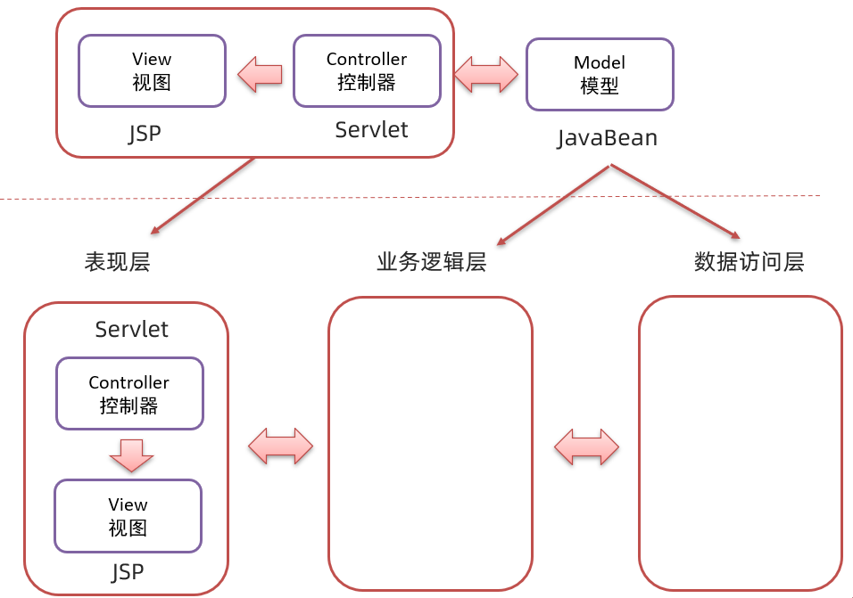

首先复习一下,SpringMVC架构

### 1 MVC模式

MVC 是一种分层开发的模式，其中：

* M：Model，业务模型，处理业务

* V：View，视图，界面展示

* C：Controller，控制器，处理请求，调用模型和视图

控制器（serlvlet）用来接收浏览器发送过来的请求，控制器调用模型（JavaBean）来获取数据，比如从数据库查询数据；控制器获取到数据后再交由视图（JSP）进行数据展示。

**MVC 好处：**

* 职责单一，互不影响。每个角色做它自己的事，各司其职。

* 有利于分工协作。

* 有利于组件重用

#### 1.2.  MVC 和 三层架构

通过 MVC 和 三层架构 的学习，有些人肯定混淆了。那他们有什么区别和联系？

如上图上半部分是 MVC 模式，上图下半部分是三层架构。 `MVC 模式` 中的 C（控制器）和 V（视图）就是 `三层架构` 中的表现层，而 `MVC 模式` 中的 M（模型）就是 `三层架构` 中的 业务逻辑层 和 数据访问层。

可以将 `MVC 模式` 理解成是一个大的概念，而 `三层架构` 是对 `MVC 模式` 实现架构的思想。 那么我们以后按照要求将不同层的代码写在不同的包下，每一层里功能职责做到单一，将来如果将表现层的技术换掉，而业务逻辑层和数据访问层的代码不需要发生变化。

在这里项目结构,如下

原始的Web层,是通过new出一个对象,然后调用对象身上的方法,

存在一些问题,例如图上,此时的 BrandService还没有解耦,如果这时候,我们需要修改实现类,就必须更改这里的掉Web层里面的内容。

##### 缺点

**耦合度太高**了,此时如果我想改变一处,另一处也必须要改变,**不利已解耦**。

如上图,第一个,在数据层的实现当中,可能有会引用第一个实现,因此不能直接修改,必须再有一个新的实现,但是这个新的实现,就必须改变业务层的代码,因此耦合度太高

在这里引入IOC/DI以及AOP的概念,通过IOC/DI以及AOP对整个容器进行控制。

### IOC/DI以及AOP

不自己去new,而是通过外部生成自己需要的bean,这就是所谓**IOC反转控制**,存放相关对象的容器,就被称为**IOC容器**

### 

生成之后,还不能运行,因为service运行依赖于dao对象,ioc中虽然有service和dao对象,**但是service和dao对象没有关系** 需要dao对象交给service,一九二四说要绑定

总结一下,关于IOC的核心观念

在这里,主要学习了两个概念,一个是IOC(反转控制),一个是Dl(依赖注入)

IOC被称为==控制反转==,由==外部==提供对象,此过程中对象创建控制权由程序转移到外部,被称为控制反转

在这里通过di整合了两个的关系

具体使用如下

1. 创建spring的XML文件,在这个文件当中配置相应的bean对象

配置完成之后通过相应xml对象,调用相应的方法,通过外部调用,而不是·自己==new==这就是所谓IOC(控制反转)

(1)什么是控制反转呢？

* 使用对象时，由主动new产生对象转换为由==外部==提供对象，此过程中对象创建控制权由程序转移到外部，此思想称为控制反转。
  * 业务层要用数据层的类对象，以前是自己`new`的
  * 现在自己不new了，交给`别人[外部]`来创建对象
  * `别人[外部]`就反转控制了数据层对象的创建权
  * 这种思想就是控制反转
  * 别人[外部]指定是什么呢?继续往下学

(2)Spring和IOC之间的关系是什么呢?

* Spring技术对IOC思想进行了实现
* Spring提供了一个容器，称为==IOC容器==，用来充当IOC思想中的"外部"
* IOC思想中的`别人[外部]`指的就是Spring的IOC容器
